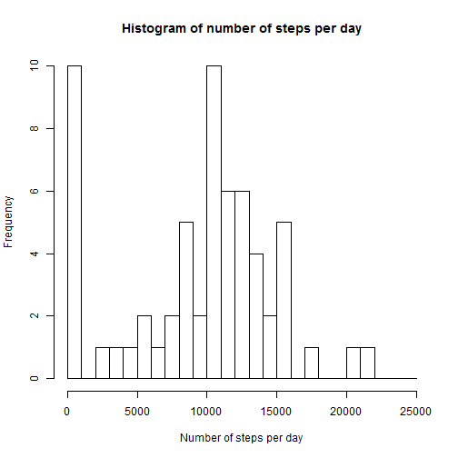
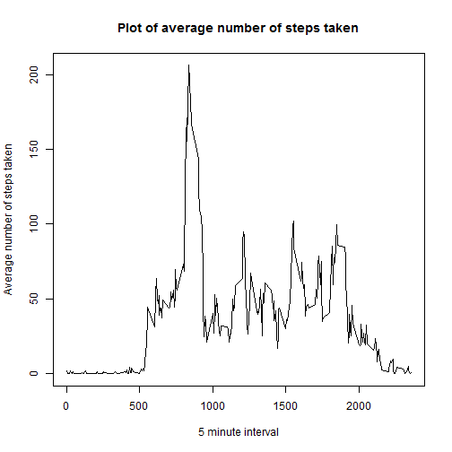
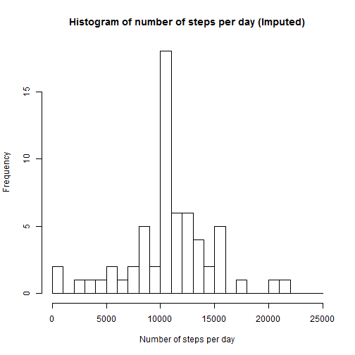
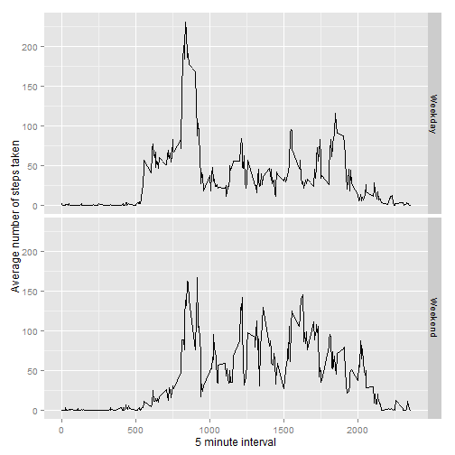

#Reproducible Research: Peer Assessment 1

## Loading and preprocessing the data

### 1.Load the data

```r
suppressPackageStartupMessages(suppressWarnings(library(dplyr)))
suppressPackageStartupMessages(suppressWarnings(library(ggplot2)))
stepdata <- read.csv("activity.csv", header = TRUE)
```

### 2. Process/transform the data (if necessary) into a format suitable for your analysis
No processing/transformation was done


## What is mean total number of steps taken per day?

### 1. Calculate the total number of steps taken per day

```r
nsteps <- stepdata %>% 
    group_by(date) %>% 
    summarise(stepsperday=sum(steps, na.rm=TRUE))
```

### 2. Make a histogram of the total number of steps taken each day

```r
hist(nsteps$stepsperday, breaks= seq(0,25000,by=1000),
     xlab = "Number of steps per day", 
     ylab = "Frequency",
     main = "Histogram of number of steps per day")
```

 

### 3. Calculate and report the mean and median of the total number of steps taken per day

```r
meansteps <- round(mean(nsteps$stepsperday), digits = 0)
mediansteps <- median(nsteps$stepsperday)
```

- Mean: 9354  
- Median: 10395


## What is the average daily activity pattern?

### 1. Make a time series plot of the 5-minute interval (x-axis) and the average number of steps taken, averaged across all days (y-axis)

```r
avgsteps  <- stepdata %>% 
    group_by(interval) %>% 
    summarise(averagesteps=mean(steps, na.rm=T))
with(avgsteps, 
     plot(interval, averagesteps, type = "l",
          xlab = "5 minute interval",
          ylab = "Average number of steps taken",
          main = "Plot of average number of steps taken"))
```

 

### 2. Which 5-minute interval, on average across all the days in the dataset, contains the maximum number of steps?

```r
intervalmax <- avgsteps[which.max(avgsteps$averagesteps), 'interval']
```

- 5-minute interval containing max. no. of steps: 835


## Imputing missing values

### 1. Calculate and report the total number of missing values in the dataset

```r
missing <- length(which(is.na(stepdata$steps)))
```

- Number of missing values: 2304

### 2. Devise a strategy for filling in all of the missing values in the dataset. 
### 3. Create a new dataset that is equal to the original dataset but with the missing data filled in.

The strategy used is to impute the missing values with the corresponding average
steps calculated previously for that specific five minute time interval.


```r
stepdataimputed <- transform(stepdata, 
                    steps = ifelse(is.na(stepdata$steps),
                    avgsteps$averagesteps[match(stepdata$interval,avgsteps$interval)],
                    stepdata$steps))
```

### 4. Make a histogram of the total number of steps taken each day and Calculate and report the mean and median total number of steps taken per day. Do these values differ from the estimates from the first part of the assignment? What is the impact of imputing missing data on the estimates of the total daily number of steps?

```r
nstepsimp <- stepdataimputed %>% 
             group_by(date) %>% 
             summarise(stepsperday=sum(steps))

hist(nstepsimp$stepsperday, breaks= seq(0,25000,by=1000),
     xlab = "Number of steps per day", 
     ylab = "Frequency",
     main = "Histogram of number of steps per day (Imputed)")
```

 

```r
meanstepsimp <- mean(nstepsimp$stepsperday)
medianstepsimp <- median(nstepsimp$stepsperday)

meandiff <- meanstepsimp-meansteps
mediandiff <- medianstepsimp-mediansteps

totsteps <- sum(stepdata$steps, na.rm = TRUE)
totstepsimp <- sum(stepdataimputed$steps)
stepsdiff <- totstepsimp-totsteps
```

- Mean (Imputed): 1.0766189 &times; 10<sup>4</sup>  
- Median (Imputed): 1.0766189 &times; 10<sup>4</sup>  
- Yes, these values differ from the estimates in the first part of the assignment.  
- The mean number of steps goes up by 1412.1886792 and the median goes up by 371.1886792
- The total number of steps before and after imputation is 570608 and 6.5673751 &times; 10<sup>5</sup> respectively.
- The total number of steps goes up by 8.6129509 &times; 10<sup>4</sup>


## Are there differences in activity patterns between weekdays and weekends?

### 1. Create a new factor variable in the dataset with two levels - "weekday" and "weekend" indicating whether a given date is a weekday or weekend day.

```r
stepdataimputed$datetype <- ifelse(!is.element(weekdays(as.Date(stepdataimputed$date)),
                                         c("Saturday","Sunday")),"Weekday","Weekend")
```

### 2. Make a panel plot containing a time series plot of the 5-minute interval (x-axis) and the average number of steps taken, averaged across all weekday days or weekend days (y-axis).

```r
avgstepsimp  <- stepdataimputed %>% 
                group_by(interval,datetype) %>% 
                summarise(averagesteps=mean(steps, na.rm=T))

ggplot(avgstepsimp, aes(interval,averagesteps))+
    geom_line()+
    facet_grid(datetype ~.)+
    labs(x="5 minute interval")+
    labs(y="Average number of steps taken")
```

 
